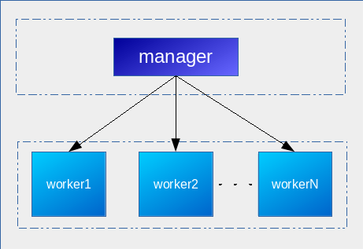

# Docker Swarm

#### Table of contents

1. [Overview](#overview)
2. [Technologies](#technologies)
3. [Authors](#authors)
4. [Contributors](#contributors)
5. [Compatibility](#compatibility)
6. [Requirements](#requirements)
7. [Setup](#setup)
8. [Exposed VMs](#exposed-vms)
9. [Tasting](#tasting)

## Overview

Tasting and findings on Docker Swarm cluster (docker-1.12+).

## Technologies

* Docker-1.12.0~rc4

## Authors

* Adriano Vieira (adriano.svieira at gmail.com)

## Contributors

* TBD

## Compatibility

Built on CentOS-7 as base.

## Requirements

- Virtualbox >= 4 (<https://www.virtualbox.org>)
- Vagrant >= 1.8 (<https://vagrantup.com>)
  * plugin vagrant-hosts (*vagrant-hosts - Manage vagrant guest local DNS resolution*)
  * plugin vagrant-hostsupdater (*Vagrant::Hostsupdater - adds an entry to your /etc/hosts file on the host system*)
  * plugin vagrant-proxyconf -**optional**- (*Proxy Configuration Plugin for Vagrant*)
    * **optional** *install and use it only if you're behind a proxy*
- Box ***`adrianovieira/centos7-docker1.12rc4`*** (https://atlas.hashicorp.com/adrianovieira/boxes)

## Setup

## Install Requirements

First of all install Virtualbox and Vagrant (if not installed yet) according to vendor manual for your platform.

    $ vagrant plugin install vagrant-hosts
    $ vagrant plugin install vagrant-hostsupdater
    $ vagrant box add adrianovieira/centos7-docker1.12rc4
    $ git clone https://github.com/adrianovieira/docker-swarm.git
    $ cd docker-swarm
    $ vagrant up

### Personalize

You could setup some environment variable for guests VM, as below:

- `OSLV_MEMORY`: VM memory on virtualbox (default: 2048MB)
- `OSLV_CPU`: VM cpu/cores on virtualbox (default: 1 cpu/core)
- `OSLV_PVTNET`: VM private network (default: 192.168.50.10)
- `OSLV_SWARM_WORKERS`: VM docker swarm workers (default: 2)

If you want to personalize one of the above variable you need to *export* then before you turn the VM up - e.g. `$ export OSLV_PVTNET=10.0.3.10 OSLV_SWARM_WORKERS=3`.

## Exposed VMs

## Tasting

We have a simple python app to taste this environment...

You could take a look at the script `setup/docker-setup-swarm_test.sh` and you could excute it to have a tasting of Swarm Cluster running a *"real but simple app"*.

After bring environment up - and if everything goes up ok ;) - go inside `manager1` and execute that script:

    $ vagrant ssh manager1

then... inside `manager1`

    $ /home/vagrant/sync/setup/docker-setup-swarm_test.sh

Well done... (if nothing goes wrong) now you could acces the application from your host browser: `http://manager1/`.

***keep CALMS and having fun***
